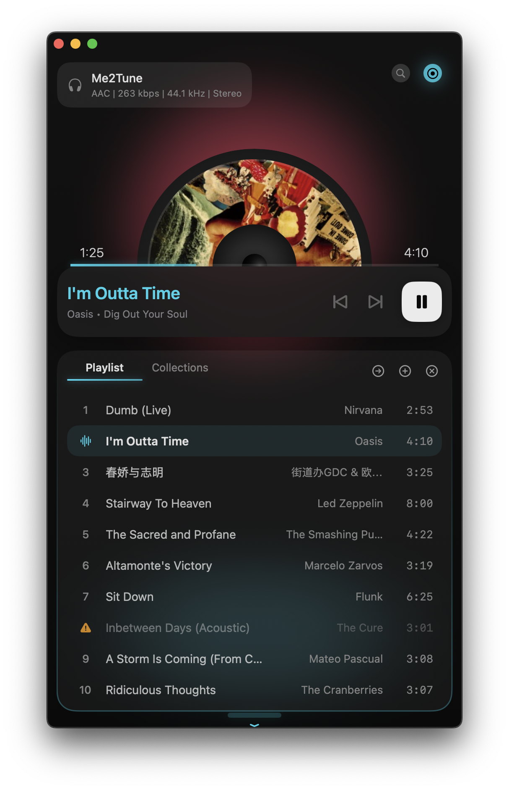
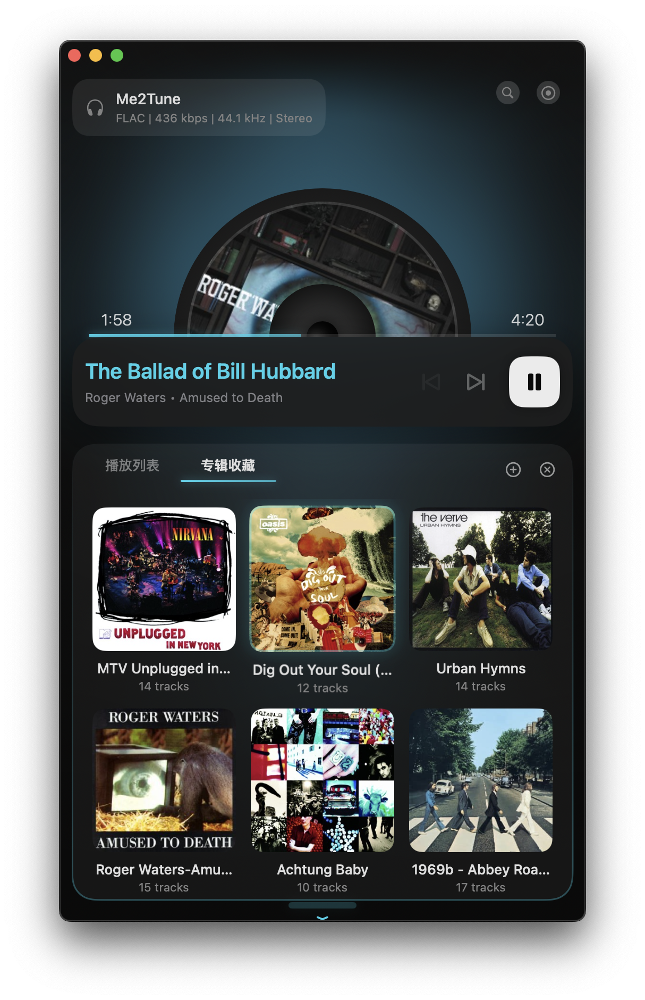
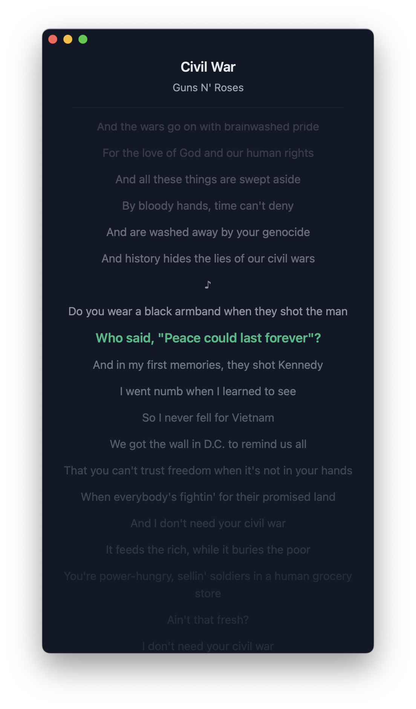
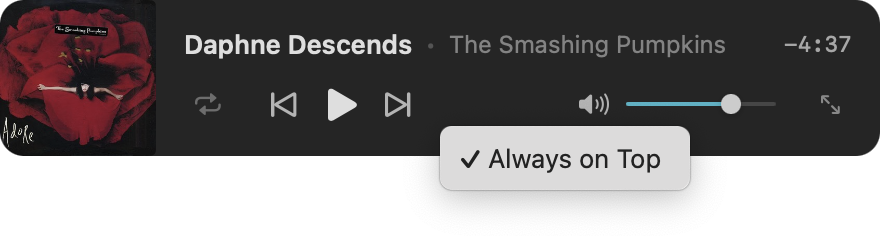
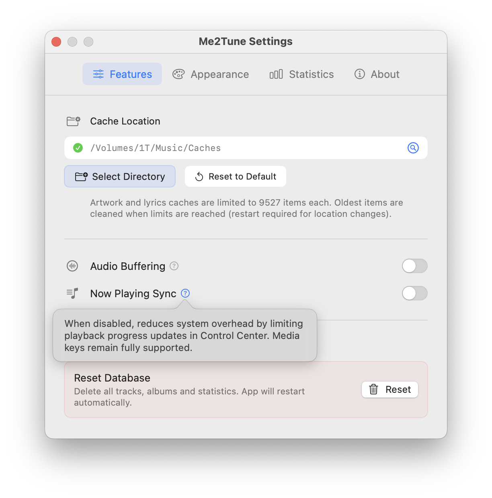
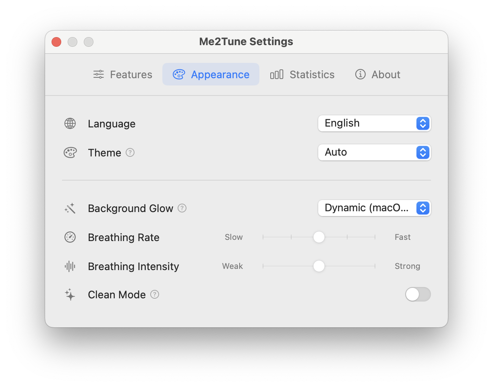
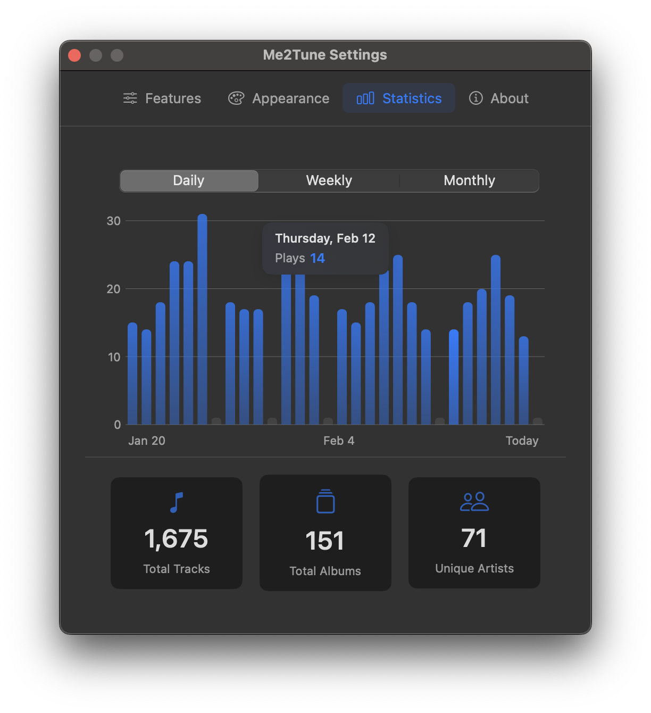

## Me2Tune

[](https://github.com/DawnLiExp/Me2Tune/actions/workflows/main.yml)
[](#)
[](https://opensource.org/licenses/MIT)

[English](README.md) | [中文](docs/README_zh.md)

Me2Tune is a macOS local music player. The official one just didn't feel right, so I made my own.

## 📸 Screenshots

<div align="center">
  
  
  
</div>

<div align="center">
  
</div>

<div align="center">
  
  
  
</div>

## ✨ Features

- Supports FLAC, MP3, AAC, ALAC, and other common audio formats
- GPU-accelerated half-disc rotation animation
- Mini floating player window
- Dedicated lyrics window with line-by-line highlight scrolling
- Playback statistics with charts
- Full macOS media key support and Now Playing integration
- Window-aware update throttling for reduced CPU overhead

## 💡 Tips

- **Drag & drop**: Both the song list and album list support manual reordering. You can drag audio files or albums into any part of the window to add them.
- **Lyrics lookup order**: Local `.lrc` file with matching name (e.g. `a.lrc` for `a.mp3`) → cached lyrics directory → [LRCLIB](https://lrclib.net/) API.
- **Cover art lookup order**: Memory cache → disk cache → embedded metadata → local image in the same directory (first supported image alphabetically, e.g. `.jpg`, `.png`).
- **Window dragging**: The window can be dragged from any area other than the Playlist and Collections.
- **Database backup/restore**: Located at `~/Library/Application Support/Me2Tune`. I use [PocketPrefs](https://github.com/DawnLiExp/PocketPrefs) for backup and restore.

## 🖥 Requirements

- macOS 14.0+ (some features require macOS 15+)

## 📦 Installation

The app is signed with a free Apple Developer account, so you'll need to remove the Gatekeeper quarantine attribute after installation.

```bash
xattr -cr /Applications/Me2Tune.app
codesign -fs - /Applications/Me2Tune.app
```

## 🛠 Tech Stack

- Swift 6 + SwiftUI with strict concurrency
- SwiftData for persistence with schema migration support
- Observation framework (`@Observable`) instead of Combine
- Structured concurrency (async/await, TaskGroup)

## 🙏 Acknowledgements

This project is made possible by [SFBAudioEngine](https://github.com/sbooth/SFBAudioEngine) for audio processing, and the generously open [LRCLIB](https://lrclib.net/) API for synchronized lyrics.

