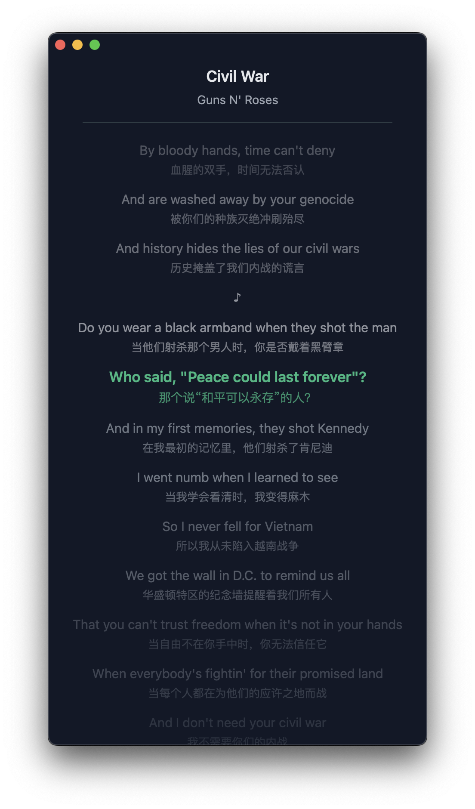

## Me2Tune

[](https://github.com/DawnLiExp/Me2Tune/actions/workflows/main.yml)
[](#)
[](https://opensource.org/licenses/MIT)

[English](../README.md) | [中文](README_zh.md)

Me2Tune 是一款 macOS 本地音乐播放器。官方的不顺手，界面不好看，所以自己做了一个。

## 📸 界面预览

<div align="center">
  
  
  
</div>

<div align="center">
  
</div>

<div align="center">
  
  
  
</div>

## ✨ 功能特性

- 支持 M4A、MP3、FLAC、AAC、ALAC 等主流音频格式
- GPU 加速的半圆唱片旋转动画
- 悬浮迷你播放窗口
- 独立歌词窗口，支持逐行高亮滚动显示
- 数据统计与可视化图表
- 完整支持 macOS 媒体快捷键及 Now Playing 信息栏集成。
- 动态调整UI更新间隔，降低开销

## 💡 使用技巧

- **拖拽操作**：歌曲列表和专辑列表均支持手动拖拽排序，全界面支持拖拽添加歌曲或专辑。
- **歌词匹配优先顺序**：同名本地歌词（如 a.mp3 对应 a.lrc）→ 缓存目录 → 在线 LRCLIB API 获取。
- **唱片封面加载策略**：内存缓存 → 磁盘缓存 → 音频文件元数据 → 同目录本地图片（按字母顺序取第一张，如 .jpg, .png 等）。
- **全域拖拽**：除播放列表 / 专辑区域外，其余区域均支持全背景拖动窗口。
- **数据库备份/恢复**：路径‘~/Library/Application Support/Me2Tune’，我使用 [PocketPrefs](https://github.com/DawnLiExp/PocketPrefs) 进行备份及恢复。

## 🖥 系统要求

- macOS 14+（部分功能需要 macOS 15+）

## 📦 安装

由于本项目使用免费 Apple Developer 账号签名，安装后需要解除 Gatekeeper 安全限制。

```bash
xattr -cr /Applications/Me2Tune.app
codesign -fs - /Applications/Me2Tune.app
```

## 🛠 技术栈

- Swift 6 + SwiftUI，严格并发安全
- SwiftData 持久化，支持 Schema 版本迁移
- Observation 框架（`@Observable`），替代 Combine
- 结构化并发（async/await、TaskGroup）

## 🙏 感谢

本项目的实现得益于 [SFBAudioEngine](https://github.com/sbooth/SFBAudioEngine) 强大的音频处理库与 [LRCLIB](https://lrclib.net/) 便捷的歌词服务，谨向这些卓越的开源项目致以诚挚谢意。
